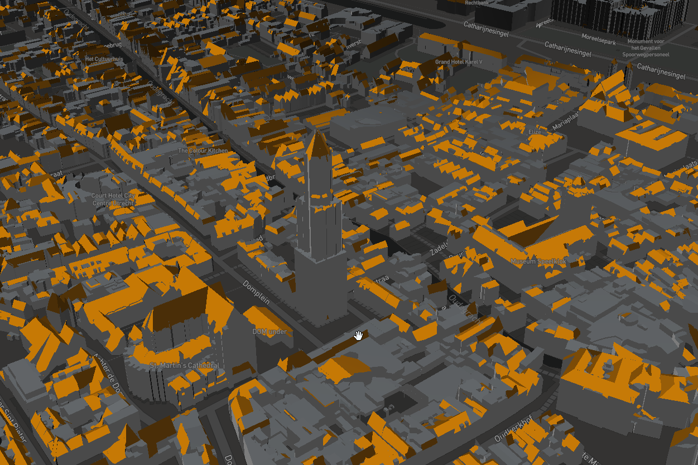

# utrecht3d

Utrecht in 3D, generated from AHN3 laser altimetry (LiDAR) from airplane or helicoptre.

Live demo: 

- Cesium: https://bertt.github.io/utrecht3d/cesium/

- MapBox: https://bertt.github.io/utrecht3d

